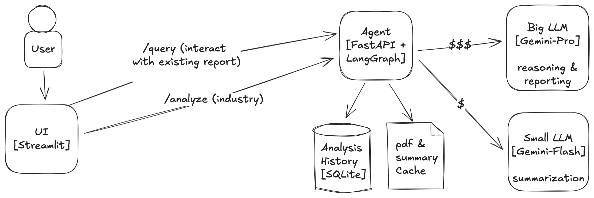

# Industry Sustainability Research Agent

This project implements an agent capable of two primary functions:

1.  **Sustainability Report Analysis:** Performing a multi-step analysis of sustainability reports for a given industry. This involves identifying key companies, searching for their reports, downloading PDFs, extracting text, summarizing individual reports, and synthesizing overall trends. Due to the load, this is done with asynchronous and multithreaded logic.
1.  **Conversational Q&A:** Answering general user queries using the LangChain ReAct framework, conversation memory, persistant report storage, etc. This feature allow the users to interact with the history of performed analysis.
1.  **UI:** Implemented using streamlit to access the agent (wrapped by FastAPI) to provide an easy way for the user to interact with the agent.

This version uses **two Google Gemini models** via `langchain-google-genai`:
*   A more powerful model (e.g., `gemini-pro` or a more advanced version) for reasoning, ReAct agent tasks, and final synthesis.
*   A faster model (e.g., `gemini-flash`) specifically for the potentially repetitive summarization of individual document chunks, configured with a **request timeout** to prevent hangs during long summarization calls.

## Usage

1.  **Prerequisites:**
    *   Python 3.11+ installed (older versions not tested).
    *   **Google API Key**, required for Gemini models. Obtain from [Google AI Studio](https://aistudio.google.com/app/apikey).
    *   Docker with docker-compose.
2.  Use docker compose to launch the application: `docker compose up`.

The application will return the right localhost link to visit to open the streamlit UI, and from there it should be self explanatory.

### Usage Considerations
1. The agent relies on an external API that costs. Anyway, the raw cost of running a report is below 1$.
1. The nature of the LLM application is that the results are not deterministic, every run of the same analysis will yield different results.
1. The logic caches the reports from already "studied" companies, so if you rerun an analysis for a given industry, the result should have some cache hit on the companies and it should be faster. Keep in mind that the first time, the analysis may take up to 10 minutes, even though the backend parallelizes heavily, the API calls to the LLM still require time—keep in mind that this logic goes through 5-7 very long pdfs (50+ slides each) and summarizes it all for you ;).

## Approach

The research agent employs a sophisticated, multi-step approach orchestrated by **LangGraph** to ensure a comprehensive and robust analysis of industry sustainability reports. This graph-based architecture allows for clear separation of concerns and resilient execution.

The core workflow is structured around several key nodes within the LangGraph:
*   **`route_request`**: Initially, this node intelligently directs the user's input, distinguishing between a full industry research task and a general conversational query.
*   **`identify_companies`**: For research tasks, an LLM (the main Gemini model) identifies key companies within the specified industry.
*   **`search_for_reports`**: This node systematically searches for sustainability reports (PDFs) for each identified company using DuckDuckGo. It incorporates a retry mechanism to handle transient search issues.
*   **`download_and_extract`**: Leveraging Python's `concurrent`, this node efficiently downloads and extracts text from multiple PDF reports in parallel. It is designed to gracefully handle failures for individual reports, ensuring the overall process can continue.
*   **`summarize_reports`**: Extracted texts are then summarized. This critical step utilizes a dedicated, faster Gemini model (`gemini-flash`) and `asyncio` for concurrent processing of multiple documents. LangChain's `map_reduce` summarization strategy is employed, breaking down large documents into manageable chunks, summarizing them individually, and then combining these partial summaries. A caching mechanism is in place for summaries to optimize performance on repeated analyses.
*   **`synthesize_trends`**: The main Gemini model then synthesizes the individual company summaries to identify overarching sustainability trends and insights for the industry.
*   **`run_basic_agent`**: For general queries, a LangChain ReAct agent (powered by the main Gemini model) with access to tools like search and conversation history provides answers.
*   **`handle_error`**: Conditional routing ensures that if any step encounters a critical error, the graph transitions to this node, providing a clear error message.

**Key Technologies & Design Choices:**

*   **LangGraph & LangChain:** LangGraph serves as the backbone for orchestrating the complex, multi-step research workflow. Its explicit state management (`UnifiedGraphState`) and node-based architecture are crucial for defining, executing, and maintaining the agent's logic. LangGraph offers superior modularity, easier debugging of individual steps, and more transparent control flow. This makes it ideal for building robust, stateful agents where different paths can be taken based on intermediate results or errors. LangChain provides the essential components (LLMs, tools, document loaders, text splitters, summarization chains) that are seamlessly integrated within the LangGraph structure.
*   **Dual Google Gemini Models:**
    *   A powerful model (e.g., `gemini-pro`) handles complex reasoning, company identification, ReAct agent tasks, and final trend synthesis.
    *   A faster, cost-effective model (e.g., `gemini-flash`) is dedicated to the parallel summarization of document chunks, configured with a request timeout to prevent hangs. This dual-LLM strategy optimizes both performance and cost.
*   **Multi-Layered Caching Strategy:** To optimize performance, reduce redundant computations, and minimize API costs, the agent implements several layers of caching:
    *   **PDF Caching:** The `download_pdf_tool` caches downloaded PDF files, preventing re-downloads of the same report.
    *   **Summary Caching:** Individual company report summaries generated by the `summarize_reports` node are cached to disk (`summary_cache` directory). This significantly speeds up subsequent analyses involving the same companies.
    *   **Analysis History (SQLite):** Completed analysis tasks, including the industry, identified companies, and the final synthesized result, are stored in a SQLite database. This allows users to query past analyses and retrieve results quickly without rerunning the entire process.
    *   **LangGraph State & ReAct Agent Memory:** LangGraph inherently manages the state of the ongoing research workflow. For the conversational Q&A part, the ReAct agent utilizes `ConversationBufferMemory` to maintain context within a session.
*   **Parallelism & Concurrency:**
    *   PDF download and text extraction are parallelized using `ThreadPoolExecutor`.
    *   Report summarization is performed concurrently using `asyncio.gather`, significantly speeding up the analysis of multiple documents.
*   **Robustness & Maintainability:**
    *   The system is designed for resilience. Failures in retrieving or processing a report for one company do not halt the entire analysis for others.
    *   Retry mechanisms are implemented for critical operations like web searches.
    *   Extensive logging throughout the application provides detailed insights into the agent's operations, aiding in debugging and maintenance. Each node's execution and important decisions are logged.

This approach, centered around LangGraph's orchestration capabilities and augmented by strategic caching and parallel processing, ensures a scalable, efficient, and fault-tolerant system capable of delivering in-depth sustainability insights while providing a detailed audit trail through comprehensive logging.

## Deployment

For details on deploying this application, including a proposed AWS architecture, scalability, reliability, security considerations, and LLMOps aspects, please refer to the [Deployment Strategy](./docs/DEPLOYMENT.md).
