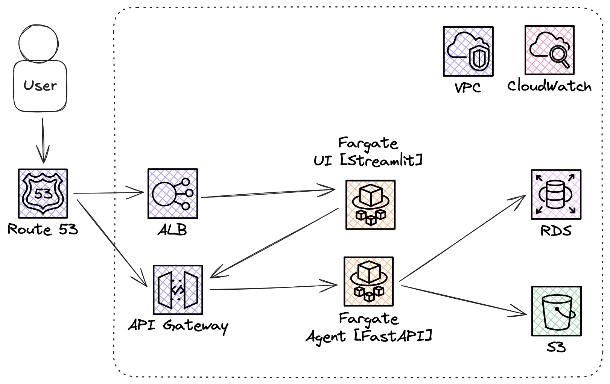

# AWS Deployment Strategy

This document outlines a deployment strategy for the Industry Sustainability Research Agent, focusing on leveraging Amazon Web Services (AWS) for scalability, reliability, security, and operational excellence.

### *DISCLAIMER*
In the next section, I am thinking big with the intention to show the reader that I can architect and implement a complex, highly scalable, highly available, and robust application.

In a real-life situation, I would also prioritize other aspects like maintainability, the skills within the team, the real goals of the company, etc. I would thoroughly challenge the need to bloat the architecture before anything and question the functional requirements. *Do we really need so many 9s of availability? Do we really need Kubernetes?, etc.*

## 1. AWS Deployment Architecture Overview

The application consists of three main components:
1.  **FastAPI Backend**: The core agent logic, LLM interactions, and API endpoints.
2.  **Streamlit UI**: The user interface for interacting with the agent.
3.  **Database**: Stores analysis history and cached data.

A container-based deployment using Docker is the core approach, utilizing AWS container services.

**Proposed AWS Architecture:**

*   **Container Orchestration (Amazon ECS with AWS Fargate):**
    The FastAPI backend would run as a scalable set of containerized services on ECS using Fargate for serverless compute. This minimizes operational overhead for managing underlying instances. The Streamlit UI would also run as a containerized service on ECS with Fargate.
    *   *Reasoning*: These containers are light and mainly I/O bound; most of the work is done by the LLM. Fargate is a good option that will ideally save operational costs, both on infrastructure and maintenance efforts.
*   **API Gateway (Amazon API Gateway):**
    Manages incoming traffic, routing requests to the appropriate backend API service.
    *   *Reasoning*: It is serverless and handles SSL termination, rate limiting, request/response transformation, and can integrate with AWS WAF for security and Amazon Cognito for authentication if external access is needed.
*   **Database Service (Amazon RDS - PostgreSQL/MySQL or Aurora Serverless):**
    Migrating from SQLite to a managed relational database. For low-traffic internal use, Amazon RDS with a small PostgreSQL or MySQL instance is suitable. Amazon Aurora Serverless v2 could also be an option for its ability to scale down to low capacity, potentially optimizing costs for sporadic usage.
    *   *Reasoning*: SQLite is fine for quick development, but for a long-term application, I would rely on more persistent storage. Such a DB might grow with features around the human feedback loop and other application features. Having it in a service like RDS makes it a reliable and durable option, with little room for accidental data loss.
*   **Persistent Storage (S3):** For storing downloaded PDF reports and potentially large summary cache files. S3 offers high durability, scalability, and cost-effectiveness for object storage.
*   **Load Balancer (Application Load Balancer - ALB):**
    Distributes incoming HTTP/HTTPS traffic across multiple instances of the UI running on ECS, ensuring high availability and scalability, even if only one instance is typically active for low traffic.

## 2. Key AWS Well-Architected Considerations

This section highlights crucial aspects for a scalable, reliable, and secure deployment on AWS:

*   **Scalability & Performance:**
    *   Utilize **AWS Fargate on ECS** for serverless container orchestration of backend and UI services, with **Application Auto Scaling** to match demand and optimize costs (scaling down to minimal tasks for low traffic).
    *   Employ **Amazon RDS (PostgreSQL/MySQL) or Aurora** for database needs, offering easy scaling and, with Aurora Serverless, automatic capacity adjustments.
    *   For LLM API rate limits, consider **Amazon SQS** for asynchronous request processing if needed.
*   **Reliability & Resilience:**
    *   Achieve high availability by deploying ECS Fargate services and RDS instances across **multiple Availability Zones (AZs)**.
    *   Use **Application Load Balancer (ALB)** health checks for automated replacement of unhealthy Fargate tasks.
    *   Implement **automated RDS backups** and S3 versioning for data durability.
    *   Leverage **Amazon CloudWatch** for centralized logging and alarms on critical operational issues.
*   **Security & Compliance:**
    *   Enforce the principle of least privilege with **AWS IAM roles** for ECS tasks and other services.
    *   Isolate resources using **Amazon VPC**, placing Fargate tasks and RDS in private subnets, and control traffic with **Security Groups**.
    *   Manage sensitive data like API keys and database credentials securely with **AWS Secrets Manager**.
    *   Protect data in transit with **HTTPS** (via ALB/API Gateway) and at rest using encryption features for RDS and S3 (SSE-S3/SSE-KMS).
    *   For external access, secure APIs with **Amazon API Gateway** (using IAM, Cognito, or Lambda authorizers) and consider **AWS WAF**.

These practices provide a robust foundation for the application on AWS, balancing operational excellence with cost-effectiveness for an internal tool.

## 3. LLMOps and other Operational Considerations

This section details aspects related to managing the LLM lifecycle, ensuring ongoing quality, and maintaining the application efficiently, especially as an internal tool.

*   **LLM Management & Flexibility:**
    *   **Current Model (Google Gemini):** API keys are managed via AWS Secrets Manager. Monitor usage and costs associated with the Gemini API.
    *   **Future AWS Integration (Amazon Bedrock):** Consider migrating to Amazon Bedrock to access Gemini or other foundation models. This can simplify API key management (using IAM roles), potentially offer better integration with AWS monitoring tools, and provide a unified interface if multiple models are explored.
    *   **Self-Hosted Open Source LLMs (Optional - Advanced):** For significant cost savings at scale or specific customization needs, self-hosting models (e.g., using Ollama on EC2 instances or ECS with GPU support) is a long-term option. However, this introduces substantial operational overhead for model management, scaling, and maintenance.
*   **Observability, Continuous Evaluation & User Feedback:**
    *   **Centralized Logging & Metrics:** Utilize CloudWatch Logs for all application and service logs. Define CloudWatch Metrics for KPIs like report processing time, LLM call latency/errors, cache hit/miss rates, and user feedback scores. Create CloudWatch Dashboards for visualization.
    *   **Continuous Evaluation Strategy:**
        *   Establish a "golden dataset" of sample industries/reports with expected high-quality outputs. Periodically rerun these and compare results to detect regressions.
        *   Consider using an LLM-as-a-judge approach (e.g., a separate Bedrock Claude call) to evaluate the coherence, relevance, and factual accuracy of generated summaries and syntheses against predefined criteria.
    *   **User Feedback Mechanism:** The Streamlit UI should include a simple way for users to provide feedback (e.g., thumbs up/down, a short comment) on the quality of the analysis. This feedback should be logged to CloudWatch or stored in RDS for analysis. This data can highlight areas for prompt improvement or identify problematic data sources.
*   **Responsible AI & Safety:**
    *   **Managing Hallucinations:**
        *   Clearly label all AI-generated content in the UI, advising users to verify critical information.
        *   Prompts should encourage fact-based responses and discourage speculation.
        *   If possible, implement simple cross-referencing logic (e.g., ensuring synthesized claims can be traced back to individual summaries or extracted text).
    *   **Prompt Injection/Leaking:** As this is an internal tool with trusted users, the immediate risk of malicious prompt injection or sensitive data leakage via prompts is relatively low. Standard input sanitization should be applied. If the tool's exposure or data sensitivity increases, more robust defenses (e.g., stricter prompt templating, output filtering, dedicated prompt security tools) would be necessary.
*   **Low-Maintenance Monitoring & Alerting:**
    *   **Automated CloudWatch Alarms:** Configure alarms for:
        *   Sustained high error rates from the FastAPI backend (e.g., >5% 5XX errors).
        *   High LLM API error rates or timeouts.
        *   Database connection failures or high latency.
        *   A significant drop in user feedback scores or a spike in negative feedback.
        *   Fargate tasks failing health checks repeatedly.
    *   **Notifications:** Send critical alerts via Amazon SNS to an email distribution list or a team chat channel. The goal is for the system to be largely self-monitoring, only requiring intervention for significant issues or clear signs of quality degradation.
*   **Prompt Engineering & Management:**
    *   **Version Control:** Store all prompts in Git alongside the application code.
    *   **Prompt Evaluation & A/B Testing:**
        *   Regularly review and refine prompts based on user feedback and evaluation results.
        *   For key prompts (synthesis, company identification), establish a process for A/B testing variations. This can be done manually initially, analyzing outputs for quality improvements.
    *   **Prompt Performance Metrics:** Track metrics like token usage per prompt, generation time, and impact on the quality of the final output.
## 4. Cost Estimation (Low-Traffic Internal AWS Deployment)

*   **Assumptions:** Intermittent internal usage (e.g., a few analyses per day/week). Focus on minimizing idle costs.
*   **Compute (ECS Fargate):**
    *   FastAPI Backend & Streamlit UI: Running 1 vCPU / 2GB RAM Fargate tasks. If active for ~20 hours/month each: 2 tasks * 20 hours * (1 vCPU * $0.04048/hr + 2GB * $0.004445/GB/hr) ≈ $4/month. Fargate scales to zero when not in use (after a cooldown), so idle costs are minimal.
*   **Database (RDS - db.t3.micro PostgreSQL):**
    *   Smallest instance: ~$15-20/month. Aurora Serverless v2 might be comparable or slightly more if minimum CUs are higher than very light RDS usage.
*   **Storage (S3 Standard):**
    *   Assuming ~5GB of PDFs/caches: 5GB * $0.023/GB/month ≈ $0.12/month. Request costs likely negligible.
*   **API Gateway:**
    *   HTTP APIs are cheaper: First 300 million requests free, then $1.00 per million. Likely <$1/month.
*   **Application Load Balancer (ALB):**
    *   Fixed cost per hour (~$0.0225/hr) + LCU usage. Minimum: ~$17/month.
*   **CloudWatch:**
    *   Generous free tier for logs, metrics, alarms. Likely negligible for low traffic.
*   **AWS Secrets Manager:**
    *   ~$0.40 per secret per month. For ~3 secrets: ~$1.20/month.
*   **Route 53 (if custom domain):**
    *   ~$0.50 per hosted zone per month.
*   **Total Estimated Base Monthly AWS Cost (excluding LLM API costs):**
    *   **Roughly $35 - $55/month.**
    *   This is a baseline. Actual costs depend on precise Fargate active time, data transfer, and specific RDS/Aurora configuration.
    *   Google Gemini API costs are separate and depend entirely on the number and complexity of analyses performed.

## 5. Deployment Plan Outline

1.  **IaC Development:** Define AWS infrastructure (VPC, ECS Cluster, Fargate Service Definitions, RDS, S3, IAM roles, ALB, API Gateway) using AWS CloudFormation or AWS CDK, or my personal preference, use Terraform.
2.  **Containerize Applications:**
    *   Finalize `Dockerfile.backend` and `Dockerfile.ui` for production (multi-stage builds, non-root users).
    *   Push images to Amazon ECR.
3.  **Set up CI/CD Pipeline (e.g., AWS CodePipeline or GitHub Actions):**
    *   Source (GitHub/CodeCommit) -> Build (CodeBuild: tests, Docker build, push to ECR) -> Deploy (CodeDeploy/ECS blue-green: to ECS Fargate).
    *   Manage environment-specific configurations and secrets injection from AWS Secrets Manager.
4.  **Provision Infrastructure:** Deploy the IaC templates.
5.  **Deploy Applications:** Use the CI/CD pipeline.
6.  **Configure DNS & Load Balancing:** Set up Route 53 and ALB.
7.  **Set up Monitoring and Alerting:** Configure CloudWatch dashboards, alarms, and log groups as per the LLMOps section.
8.  **Testing:** Thoroughly test in a staging environment.
9.  **Go Live & Iterate:** Monitor, gather feedback, and refine.

This AWS-centric deployment strategy, incorporating LLMOps principles, aims for a robust, maintainable, and cost-aware solution for internal use.
